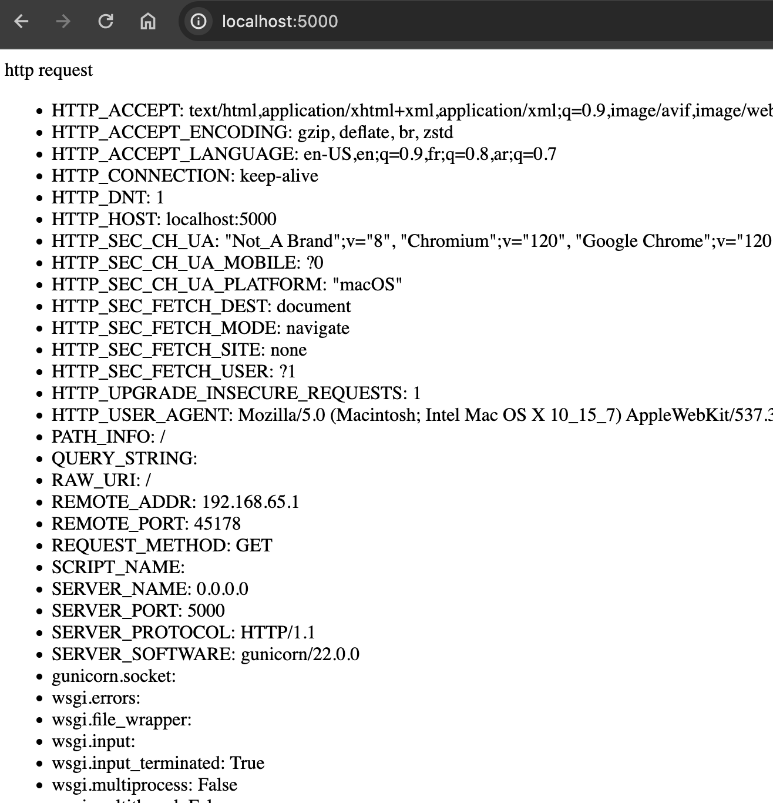
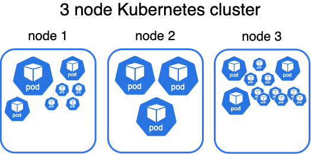
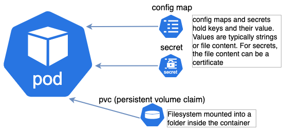
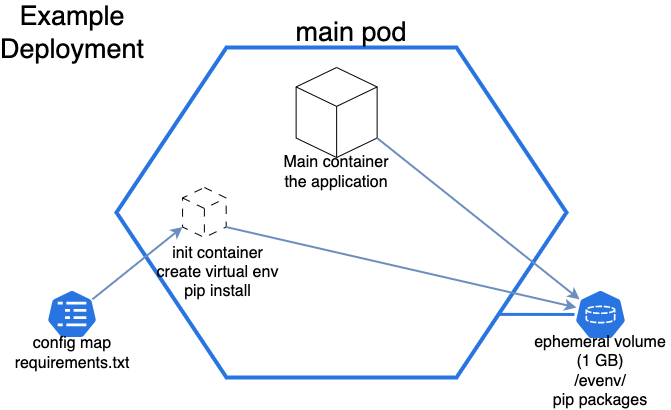

<!-- title: Docker and AI -->
<span style="font-size:2em;text-align:center;">Docker and AI</span>

AI experiments once they produce the desired output are rarely "good to go". Fast prototyping to deliver the promises of AI is a challenge by itself, paying attention to future maintainability and stability is a lesser priority.
The goal of this article is to present a few best practices that you could simply copy paste to your projects and avoid facing later operationalization issues. This mostly applies to containerized python application. 

We have faced this many time, a mini application works on a laptop and is published to a hosted environment such as [SAP BTP, Kyma runtime](https://discovery-center.cloud.sap/serviceCatalog/kyma-runtime?tab=feature&region=all). Some issues occur during the migration, some during a routine security audit, others can occur weeks later. 

- [About Docker containers](#about-docker-containers)
- [During local development](#during-local-development)
  - [Moving Config Parameters and Credentials out of the image](#moving-config-parameters-and-credentials-out-of-the-image)
  - [Moving files or folders out of the image](#moving-files-or-folders-out-of-the-image)
    - [Mounting one external file](#mounting-one-external-file)
    - [Minimize image size](#minimize-image-size)
    - [Keep external packages outside](#keep-external-packages-outside)
    - [Mounting a folder or a Python virtual environment](#mounting-a-folder-or-a-python-virtual-environment)
    - [Distinguish versions with image tags](#distinguish-versions-with-image-tags)
  - [Sample application](#sample-application)
    - [Python source file](#python-source-file)
    - [Dockerfile](#dockerfile)
    - [Build script](#build-script)
    - [Run](#run)
- [Deploying to Kubernetes (or Kyma)](#deploying-to-kubernetes-or-kyma)
  - [Prerequisites](#prerequisites)
  - [Concepts](#concepts)
  - [Prepare first deployment](#prepare-first-deployment)
    - [Declare resource consumption](#declare-resource-consumption)
    - [Add a secret and a configmap](#add-a-secret-and-a-configmap)
    - [Select a storage type for the python virtual environment](#select-a-storage-type-for-the-python-virtual-environment)
  - [Deploy and perform initial test](#deploy-and-perform-initial-test)
- [Conclusion](#conclusion)

# About Docker containers

Containers bundle the application with everything it needs to run, external libraries, configuration files, folder structures, operating system packages. Transporting an application into a new landscape becomes extremely easy, and in theory what works on the laptop of a data scientist should work equally well in a hosted environment. ... In theory ... 😁

# During local development
Your application is not made only of just python files, there could be a startup script, configuration files, credentials, pip dependencies... Packing absolutely all of it into a docker image can cause more harm than good.
For instance, adjusting a parameter shouldn't require rebuilding the image entirely. It's also critical to leave credentials out of the image.

## Moving Config Parameters and Credentials out of the image
One way to do leave configuration parameters and credentials out of the image is to pass them as environment variables. 
This example uses a linux alpine container to execute the `env` command that displays environment variables. 

There are only 3 environment variables in the default linux alpine image
```
docker run alpine:3 env
PATH=/usr/local/sbin:/usr/local/bin:/usr/sbin:/usr/bin:/sbin:/bin
HOSTNAME=7ec4045a1748
HOME=/root
```

And we pass the parameters USERNAME and PASSWORD

```
docker run -e USERNAME=remi -e PASSWORD=supersecret alpine:3 env
PATH=/usr/local/sbin:/usr/local/bin:/usr/sbin:/usr/bin:/sbin:/bin
HOSTNAME=27786f155c4f
USERNAME=remi
PASSWORD=supersecret
HOME=/root
```

With many variables, you might prefer the option to put them into files:

<table>
<tr><th>credentials.env</th><th>params.env</th></tr>

<tr><td><pre>USERNAME=remi
PASSWORD=supersecret
SERVER=hanacloud.ondemand.com:413</pre></td>
<td><pre>PARAM1=value1
PARAM2=value2</pre></td>
</tr>
</table>

And then pass all the variables in those files to the container:
```
docker run --env-file credentials.env --env-file params.env alpine:3 env

PATH=/usr/local/sbin:/usr/local/bin:/usr/sbin:/usr/bin:/sbin:/bin
HOSTNAME=31e8123ffb80
USERNAME=remi
PASSWORD=supersecret
SERVER=hanacloud.ondemand.com:413
PARAM1=value1
PARAM2=value2
HOME=/root
```

## Moving files or folders out of the image

An application might expect configuration parameters in the form of a file rather than environment variables. It this situation, the file stays out of the image, and is mounted inside it at startup.
 
### Mounting one external file
Docker uses the term “volumes” for external file storage. It is mostly intended for folders but can be used to expose single files as well. 
In the below example, we make the file `credentials.env` stored on the host machine visible in read only inside a container.
```
docker run -it \
   --mount type=bind,source=./credentials.env,target=/root/credentials.env,readonly alpine:3 sh
# ls /root
credentials.env
/ # cat /root/credentials.env 
USERNAME=remi
PASSWORD=supersecret
SERVER=hanacloud.ondemand.com:413
```

### Minimize image size
Large docker images are problematic:
-	Longer build and startup time. 
-	Longer startup time of other applications on the same kubernetes cluster due to image cache polution
-	Higher resource consumption (Kubernetes memory, cpu to uncompress the image, storage in the image registry, network in between)

⚠️ For nearly all python applications, the *“slim”* version of the official base image works just as well but is almost 7 times smaller! *python:3.12* is **1 GB** wheras *python:3.12-slim* is only **150 MB**!

### Keep external packages outside
In the case of python, pip packages might amount to an enormous volume, for instance hana-ml is 430 MB, nltk for natural language processing is 3.4GB 
The situation is similar with the NodeJS runtime and the npm package manager, the most basic CAP project has libraries amounting to 4500 files.

### Mounting a folder or a Python virtual environment
A [virtual env](https://docs.python.org/3/library/venv.html) is the recommended way to separate an application from its runtime environment and pip packages dependencies.
Virtual environment are platform specific so you can’t share the same one between windows, mac and linux. What you should share are the steps to recreate it and the pip requirements file.

To make a linux virtual env in a folder outside of a docker image, and populate it with pip packages:
1. Make an empty folder
    `mkdir examplevenv`
2. Initialize a virtual environment in that folder for python 3.12:
```
docker run -v ./examplevenv:/venv python:3.12-slim python -m venv /venv
```
3. Install pip dependencies from a local file `requirements.txt` into the virtual environment
```
docker run --mount type=bind,source=./requirements.txt,target=/tmp/requirements.txt,readonly -v ./examplevenv:/venv python:3.12-slim /venv/bin/pip install -r /tmp/requirements.txt
```
And now you can use a virtual environment with all the packages you want with a light python image. Here we use a python base image and simply call the python program from the virtual env instead of the default one. This loads the virtual environment and displays the version of the `hana-ml` package
```
docker run -v ./examplevenv:/venv python:3.12-slim /venv/bin/python -c "import hana_ml
print(hana_ml.__version__)"
2.20.24042601
```

### Distinguish versions with image tags
In the course of prototyping, the image is rebuilt often, more often than it is published. When images are built without tags, the implicit tag “latest” is used.
This can lead to multiple issues:
+ Difficulty to quickly rollback to a previous version.
+ Ambiguity of versions, you could be running on the previous “latest” due to caching
+ If a cluster event restarts the app, and the image “latest” is pulled, this could inadvertedly deploy a new version. Surprise! Unplanned and silent application version upgrade… 

A simple script that builds the image could be tweaked to include the current date as a tag. This first shell command puts the current date in a specific format into a variable. The second builds the image and tags it with the current date:
```shell
TAG_DATE=$(date +%Y-%m-%d.%HH%M)
docker build -t dockerblog:$TAG_DATE -t dockerblog:latest .
```
This creates an image with 2 tags. The 2 lines have the same image ID:
<pre>
docker image ls dockerblog
REPOSITORY   TAG                IMAGE ID       CREATED        SIZE
dockerblog   2024-05-23.10H04   f02520f8bbe8   18 hours ago   130MB
dockerblog   latest             f02520f8bbe8   18 hours ago   130MB
</pre>
In a kubernetes deployment, there is a built-in change versioning mechanism to record when image tags are updated, the command `kubectl rollout undo` is enough to rollback a deployed application to a previous version.

## Sample application
To illustrate those concepts, we’ll use a simplified python web app.

### Python source file
<details>
<summary>The main source file is [`sampleapp.py`](./sampleapp.py)</summary>

```python

from os import environ as osenv
from subprocess import run as subrun

html_env="<ul>" + "\n".join([f"<li>{k}:  {v}</li>" for k,v in osenv.items()]) + "</ul>"
cp=subrun(['python3', '-m', 'pip', 'list', '--no-color'], capture_output=True)
html_pip="<ul>" + "\n".join([ f"<li>{l.split()[0]}:  {l.split()[1]}</li>" for l in cp.stdout.decode().split('\n')[2:-1]]) + "</ul>"

def app(query, start_response):
        elements=set(list(query.keys()))

        html_query="<ul>" + "\n".join(
                [ f"<li>{k}:  {query[k]}</li>" 
                    for k in sorted(elements) ]) + "</ul>"
        html_data=f"""<html>
            <p>http request{html_query}</p>
            <p>pip modules{html_pip}</p>
            <p>environment variables {html_env}</p>
        </html>"""
        data = html_data.encode()
        start_response("200 OK", [
            ("Content-Type", "text/html"),
            ("Content-Length", str(len(data)))
        ])
        return iter([data])

```
</details>

### Dockerfile

This Dockerfile is slightly more complex because we implemented the extra security to run the application as non root. Once the application becomes stable, you should replace the last CMD instruction by ENTRYPOINT to lock the image as a webapp.
<details>

<summary>Dockerfile</summary>

```docker
FROM python:3.12-slim

ENV PORT=5000
#create group with a predetermined GID of 2000 and user
RUN groupadd -g 2000 sampleapp && useradd -u 1000 -g sampleapp -m sampleapp

EXPOSE $PORT
#switch current user from root to the new user
USER sampleapp:sampleapp

COPY *.py /home/sampleapp/

WORKDIR /home/sampleapp/

ENV PATH "/venv/bin:${PATH}" 
ENTRYPOINT [ "gunicorn", "--preload", "sampleapp:app" ]
```
</details>

### Build script

The image is built using the script [` build.sh`](./build.sh)
The line that matters is the “docker build …” command, the rest is for print, error detection and handling environment variables.
<details>
<summary>build.sh</summary>

```shell
#!/bin/sh

# current date in the format: 2024-05-23.09H10
TAG_DATE=$(date +%Y-%m-%d.%HH%M)

# detect if an external image registry is configured
if [ "z${IMGREGISTRY}z" = "zz" ]; then
    echo "An image registry is required for Kubernetes. Please set env variable IMGREGISTRY"
    REGISTRY_TAG=""
    PUBLISH=0
else
    REGISTRY_TAG="-t ${IMGREGISTRY}/dockerblog:${TAG_DATE}"
    PUBLISH=1
fi


docker build -t dockerblog:$TAG_DATE \
             -t dockerblog:latest \
             $REGISTRY_TAG \
    --label "builton=$(hostname)" \
    --label "builtby=$(whoami)" \
    . >build.log 2>&1

BUILD_CODE=$?

#check the return status of the build command
if [ $BUILD_CODE -eq 0 ] ; then
    # print image size
    IMG_SIZE=$(docker image  ls dockerblog:$TAG_DATE --format json | jq -r '.Size')
    echo "Image dockerblog:${TAG_DATE} size is ${IMG_SIZE}" 

    if [ $PUBLISH -eq 1 ] ; then
        echo publishing image to $IMGREGISTRY
        docker push ${IMGREGISTRY}/dockerblog:${TAG_DATE} 
        echo 
        echo "To update your running deployment, execute"
        echo kubectl -n dockerblog set image deployment/dummydep my-supper-app=${IMGREGISTRY}/dockerblog:${TAG_DATE}
    fi
else
    echo !! Image build failed !!
    echo " - - - - build.log - - - "
    # print the content of the log file with a tab prefix to make it look like indentation
    awk '{ print "\t" $0 }' build.log
    echo " - - - - - - - - - - - - - "
fi

```

</details>

### Run
<pre>
docker run -v $(pwd)/examplevenv/:/venv -p 5000:5000 dockerblog
[2024-05-27 17:34:14 +0000] [1] [INFO] Starting gunicorn 22.0.0
[2024-05-27 17:34:14 +0000] [1] [INFO] Listening at: http://0.0.0.0:5000 (1)
[2024-05-27 17:34:14 +0000] [1] [INFO] Using worker: sync
[2024-05-27 17:34:14 +0000] [7] [INFO] Booting worker with pid: 7
</pre>
And open the app using a web browser at [http://localhost:5000](http://localhost:5000)



# Deploying to Kubernetes (or Kyma)
## Prerequisites 

**Having access to a kubernetes cluster** such as [SAP BTP Kyma Runtime](https://help.sap.com/docs/btp/sap-business-technology-platform/trial-accounts-and-free-tier), available in trial, free tier and enterprise contract. 

The command line tool `kubectl` [has been installed and configured](https://developers.sap.com/tutorials/cp-kyma-download-cli..html).  
Create a dedicated namespace

`kubectl create ns dockerblog`

A working access to an internet facing docker registry is required. The build script expects the registry name to be set in the environment variable `IMGREGISTRY` and for credentials to be stored so that publishing can happen without reentering a password.
<pre>
export IMGREGISTRY=...
docker login ... --username ... --password ...
</pre>

<p>
<details>

<summary>(Optional) Confirm permission to push to the image registry
</summary>

```
docker push $IMGREGISTRY/python:3.12-slim
The push refers to repository [your_img_registry/python]
2eb7c5261c95: Mounted from dockerblog 
a9435642a9e3: Mounted from dockerblog 
b3232f6d8e2e: Mounted from dockerblog 
146826fa3ca0: Mounted from dockerblog 
5d4427064ecc: Mounted from dockerblog 
3.12-slim: digest: sha256:fd3817f3a855f6c2ada16ac9468e5ee93e361005bd226fd5a5ee1a504e038c84 size: 1370

```

</details>
</p>


Finally, it is strongly recommended to have an editor with syntax highlithing for the yaml language.


## Concepts
To host your docker based application on Kubernetes, Here’s a quick recap of what you need to know:
A kubernes cluster is a set of servers called nodes. For the BTP Kyma runtime, nodes are virtual machines whose size ranges from 8GB of RAM and 2 vcpu up to 256GB and 64 vcpu. 



Pods are the most important concept, they represent the application and its running docker image. 


A pod is a logical envelope with at least one container. When configuration parameters and credentials are moved outside of the image, they can be stored as config maps and secrets. The external folder is to a PVC mounted inside the container as an external filesystem.
Simple pods only have one container, more complex pods could have multiple containers.


An artifact called “deployment” will define the pod and all of the surrounding artifacts displayed above.
To segregate all these artifacts between application or tenants, isolation is implemented using namespaces.

## Prepare first deployment
### Declare resource consumption
For the overall cluster health, we strongly recommend to declare the normal and maximum resource consumption of all applications, in Kubernetes terminology, it’s requests and limits.
You can use your local docker image to find out approximate values. Make sure you the application has done some work before checking metrics, a freshly started image will report less memory. Here we use one command to list the containers running the image `dockerblog:latest`, and we print stats for them.
<pre>
docker stats --no-stream $(docker ps -f ancestor=dockerblog:latest -q)
CONTAINER ID   NAME            CPU %     MEM USAGE / LIMIT     MEM %     NET I/O           BLOCK I/O     PIDS
bfce8bccbae8   dreamy_shamir   0.02%     113.1MiB / 4.308GiB   2.56%     41.8kB / 7.02kB   0B / 49.2kB   13
</pre>


The default memory limit for containers on this machine is **4.3 GB**. We can lower this limit by adding `--memory=200m` to the docker run command. This produces the following result:<pre>
docker stats --no-stream $(docker ps -f ancestor=dockerblog:latest -q)
CONTAINER ID   NAME               CPU %     MEM USAGE / LIMIT   MEM %     NET I/O           BLOCK I/O     PIDS
b93fff046809   beautiful_sammet   0.02%     108.1MiB / 200MiB   54.07%    43.8kB / 14.2kB   0B / 81.9kB   13
</pre>
We’ll add a safety margin and use the values 150 MB / 250 MB for the requests / limits in the corresponding Kubernetes deployment. When values are small like this, we round it up without much drawback.
To find the values for CPU requests and limits, you can set a limit in docker run with the option `--cpus="0.3"` for 30% of a single vcpu and see how this affects response times.
In this example, the response time fluctuated in the same intervals with and without a limit to 0.3. Therefore we’ll use the values of 0.2 and 0.5 for requests and limits
Don’t spend too much time figuring it out the best values for requests and limits, make a guess and move on &#x1F600; . After a while, you can check usage statistics to adjust the values.

### Add a secret and a configmap
Create a secret in the namespace to store the credentials to the image registry.
```
kubectl create secret -n dockerblog docker-registry mydockerregistry --docker-server=$IMGREGISTRY --docker-username=… --docker-password=… 
```
Put the pip requirements file as a config map.
```
kubectl -n dockerblog create configmap pip-reqs --from-file=requirements.txt --save-config=true
```
If you want to create the config map without using a requirements file, you can do so but new line must be represented with `$'\n'` 

<details>
<summary>the command is difficult to read:</summary>
<pre>
kubectl -n dockerblog create configmap pip-reqs --from-literal=requirements.txt="hana-ml"$'\n'"generative-ai-hub-sdk"$'\n'"gunicorn"
</pre>
</details>

### Select a storage type for the python virtual environment

To store pip packages outside of the docker image, we need to select one of 3 storage options:

| Volume Type |Impact on pod start time	|Maintenance overhead	| Risk |
| - | - | - | - |
| emptyDir	| None| None	| No guarantee that the requested space is available! Overload the host filesystem.|
|Ephemeral volume|	At least 1 minute	|None	|None|
|Persistent volume|	None |(after creation)	Additional steps: create and delete|	None|

In the example below, the chosen method is ephemeral storage because it represents a trade off and there are plenty of other tutorials explaining how to use the other 2. 
Ephemeral storage uses the exact same volumes as persistent storage, except the creation and deletion is coupled automatically with the lifecycle of the pod. It is created when the pod starts, it persists if the main container crashes, and it is removed after the pod stops. 

## Deploy and perform initial test


Replace #YOUR_REGISTRY# with your value in [`template.deployment.yaml`](./template.deployment.yaml)
There are tools to handle templates and specific values per environment but for now a simple string substitution would work. For instance this command performs the string replacement and creates another file.
<pre>
sed -e "s/#YOUR_REGISTRY#/$IMGREGISTRY/" template.deployment.yaml > deployment.yaml</pre>
<details>
<summary>template.deployment.yaml</summary>

```yaml
apiVersion: apps/v1
kind: Deployment
metadata:
  name: dummydep
spec:
  replicas: 1 #scaling to multiple replicas is a distinct topic
  selector:
    matchLabels:
      app: dummydep
  strategy:
    #Recreate: Terminate pods before starting new one. Consumes less resources but requires a small downtime
    #RollingUpdate(default): start new pods, when ready terminate old ones.
    type: Recreate
  template:
    metadata:
      labels:
        app: dummydep
        #sidecar.istio.io/inject: "true"
    spec:
      volumes:
        - name: virtualenv-volume
# - - - Ephemeral volume - - - 
          ephemeral:
            volumeClaimTemplate:
              metadata:
                labels:
                  type: my-virtualenv-volume
              spec:
                accessModes: [ "ReadWriteOnce" ]
                #specifically for azure, we choose a cheaper storage tier
                #otherwise, use "default"
                storageClassName: "managed-standard-hdd"
                resources:
                  requests:
                    storage: 1Gi
        - name: pip-requirements
          configMap: 
            name: pip-reqs
            items: 
              - key: requirements.txt
                path: requirements.txt
      imagePullSecrets:
        - name: mydockerregistry
      initContainers:
        - name: prepare-python-venv 
          image: python:3.12-slim
          command: ["sh", "-c", "python3 -m venv /venv/; /venv/bin/pip3 install --no-cache-dir -r /root/requirements.txt" ]
          volumeMounts:
          - name: virtualenv-volume
            mountPath: /venv/
          - name: pip-requirements
            mountPath: /root/
          resources: 
            limits: # it takes some resources to download and uncompress libraries
              memory: 350Mi
              cpu: 1500m
          env:
            # skip the check and avoid a warning
          - name: PIP_DISABLE_PIP_VERSION_CHECK
            value: "1"
# - - - - - - - - - - - - - - - - - - - - - - -             
      containers:
      - image: #YOUR_REGISTRY#/dockerblog:latest
        imagePullPolicy: IfNotPresent #because we use a specific version, not 'latest'.
        name: my-supper-app
        ports:
        - containerPort: 5000
        volumeMounts:
          - name: virtualenv-volume
            mountPath: /venv/
            readOnly: true
# CPU and memory resources are shared and pooled to minize costs.
# Not all applications will peak at the same time so the total of all allocations is higher than the hardware capacity
# To minimize the risks associated, it is highly recommended to reserve the correct amount of resources.
        resources: 
          limits: #limits = absolute maximum. If Above -> out of memory -> kill & restart
            memory: 250Mi
            cpu: 500m
          requests: #actual consumption most of the time. If above, nothing happens.
            memory: 150Mi
            cpu: 200m

```

</details>

You then push the deployment with
<pre>kubectl -n dockerblog apply -f deployment.yaml
deployment.apps/dummydep created
</pre>

It will take a few minutes for the volume to be provisioned and bound. If you have recently deleted volumes, space can be recycled and the command completes immediately. 
<details>
<summary>To block until the volume is ready, you can execute this command</summary>

```
kubectl wait -n dockerblog --for=jsonpath='{.status.phase}'=Bound $(kubectl -n dockerblog get pvc --no-headers -o name)

persistentvolumeclaim/dummydep-55549b5cc8-cpn2g-virtualenv-volume condition met
```
</details>
After the volume is ready, the pod will create the init container that performs the pip install. 
<details><summary>You can check the logs</summary>

```
kubectl -n dockerblog logs deployment/dummydep -c prepare-python-venv

[...]
Downloading gunicorn-22.0.0-py3-none-any.whl (84 kB)
   ━━━━━━━━━━━━━━━━━━━━━━━━━━━━━━━━━━━━━━━━ 84.4/84.4 kB 42.2 MB/s eta 0:00:00
Downloading hana_ml-2.20.24042601-py3-none-any.whl (9.1 MB)
   ━━━━━━━━━━━━━━━━━━━━━━━━━━━━━━━━━━━━━━━━ 9.1/9.1 MB 80.0 MB/s eta 0:00:00
Downloading hdbcli-2.20.23-cp34-abi3-manylinux1_x86_64.whl (10.8 MB)

[...]
```
</details>

If all goes well, you should see the pod in status “running”:
```
kubectl -n dockerblog get pods
NAME                        READY   STATUS    RESTARTS   AGE
dummydep-7c686664dc-jxqm5   1/1     Running   0          9m15s
```
The deployed pod is not reachable from the internet yet, as a smoke test, you can reach it using a tunnel:
<pre>
kubectl -n dockerblog port-forward deployment/dummydep 5000:5000
</pre>
Then open a browser to connect through the tunnel http://localhost:5000

Finally, you can expose your app using a [service and decide how you’d like to secure its access later.](https://learning.sap.com/learning-journeys/deliver-side-by-side-extensibility-based-on-sap-btp-kyma-runtime/using-services-in-kubernetes_aff11684-abc6-4856-8db3-47e36b89b3c2). 
<details>
<summary>Basic service definition in yaml:</summary>

[svc.yaml](./svc.yaml)

```yaml
apiVersion: v1
kind: Service
metadata:
  name: my-dummyapp-service
spec:
  selector:
    app: dummydep
  ports:
    - protocol: TCP
      port: 5000
```
</details>


To expose the service with SSL encryption you can use the Kyma APIRule

<details>
<summary>Sample api rule</summary>

[apirule.yaml](./apirule.yaml)

```yaml
apiVersion: gateway.kyma-project.io/v1beta1
kind: APIRule
metadata:
  labels:
    app.kubernetes.io/name: dummydep-apirule
  name: dummydep-apirule
spec:
  gateway: kyma-gateway.kyma-system.svc.cluster.local
  host: dummydep
  rules:
  - accessStrategies:
    - handler: no_auth
    methods:
    - GET
    - POST
    path: /.*
  service:
    name: my-dummyapp-service
    port: 5000
```

</details>

# Conclusion

This blog has shown how to take a sample python application, make it easy to maintain, and publish it Kubernetes without impacting existing workloads.
Please give us feedback, especially if you notice something is incorrect, missing or needs clarification.
