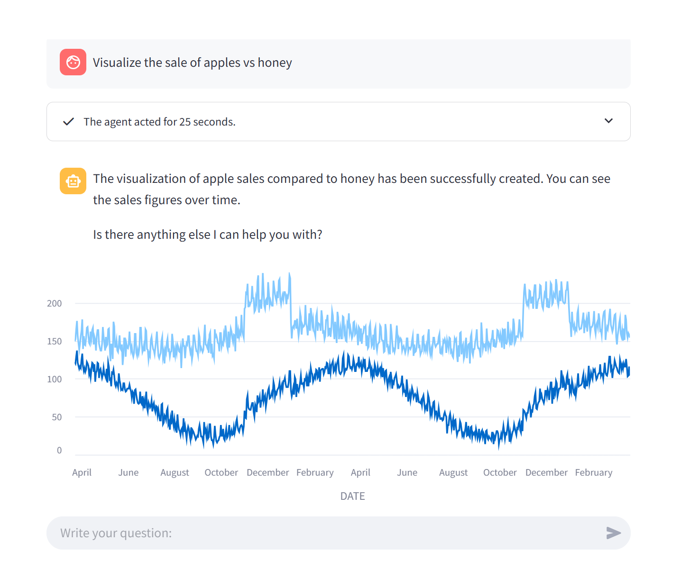

# Data Exploration and Forecasting Agent

This demo focuses on an agent dedicated to assisting users with exploratory data analysis and time series forecasting. This scenario highlights how AI agents can effectively provide insights from complex databases while ensuring clarity during data visualization and resource management.

The agent's primary capabilities include:

- **Retrieving and Clarifying Data Insights**: Helping users explore data by suggesting meaningful analysis steps. 

- **Time Series Forecasting**: Creating forecasts based on user input with a built-in mechanism to prompt for confirmation before executing resource-intensive operations like fitting time series data.

- **Visualizing Data**: Automatically generating charts when appropriate.

This agent is designed to provide a seamless experience by dynamically interpreting user goals, 
ensuring that both exploratory analysis and forecasting are conducted efficiently and accurately.

_Example Usage_: 

[//]: # (![image]&#40;insights.png&#41;)

  

