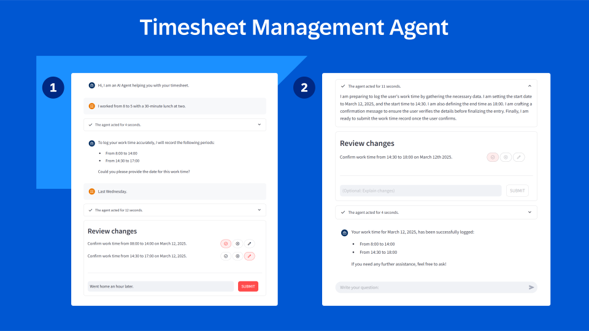

# Hands-on Timesheet Management Agent
This demo focusses on an agent dedicated to assist the user with their timesheet management.
This is a scenario where llm-based agents shine as we need to process natural language input. Additionally dynamic decision-making is required, albeit to a limited extent, e.g. the agent needs to decide on the fly whether enough information was provided by the user.

The agent's primary capabilities include:

- **Retrieving Timesheet Data**: Retrieving records from the SuccessFactor API containing the user's timesheet data.
- **Logging work hours**: Log works hours by posting records to the SuccessFactor API based on user input.
While there are other use cases that benefit more from agenticness, this demo serves the purpose of getting a good grasp of the core concepts of LangGraph by building a custom agent with human-in-the-loop control mechanisms.

A demonstration of the agent's capabilities can be found [here](https://video.sap.com/media/t/1_vn0r16zk).
For more information consult [this blog entry]().